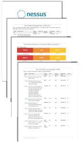

# Task 3 – Basic Vulnerability Scan on My PC  
**Cyber Security Internship – Vulnerability Assessment Task**

---

## 📌 Objective  
To perform a basic vulnerability scan on my personal computer using a free vulnerability scanning tool (Nessus Essentials or OpenVAS), identify security vulnerabilities, and generate a vulnerability report with findings.

---

## 🛠 Tools Used  
- **Nessus Essentials** (Free Vulnerability Scanner)  
- Windows 10/11  
- Command Prompt (`ipconfig`)  

---

## 🧭 Steps Performed  

### 1️⃣ Installed Nessus Essentials  
- Downloaded from the Tenable official website  
- Installed and accessed using the browser at `https://localhost:8834/`  
- Activated using the free activation code sent by email  
- Waited for plugin installation (15–20 minutes)

### 2️⃣ Identified Local IP Address  
Found the system IP address using:
ipconfig

yaml
Copy code
Used the **IPv4 Address** as the scan target.

### 3️⃣ Configured Vulnerability Scan  
- Created a new **Basic Network Scan**  
- Set the scan name: *My PC Vulnerability Scan*  
- Entered the IPv4 address as the target  
- Saved and launched the scan  

### 4️⃣ Performed Full Scan  
- Allowed the scanner to analyze ports, services, and configurations  
- Reviewed results categorized as: Critical, High, Medium, Low  

### 5️⃣ Exported the Final Report  
- Exported the PDF report from Nessus  
- Collected screenshots of:  
  - Dashboard  
  - Vulnerability summary  
  - Critical/High vulnerability details  

---

## 🖼️ Screenshots  

### 🔹 Dashboard Screenshot  

### 🔹 Vulnerability Summary  

### 🔹 Critical Vulnerability Example  

### 🔹 Medium Vulnerability Example  

---

## 🔍 Vulnerability Summary  

*(Add your real numbers when available)*

Critical: X
High: X
Medium: X
Low: X
Informational: X

yaml
Copy code

---

## 📤 Submission  
All necessary files — PDF report, screenshots, and README — are included in this repository as required by the internship task instructions.

